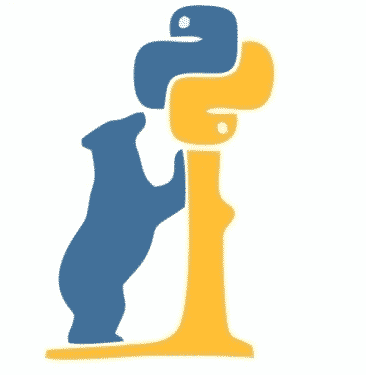

### Hi there, I'm Ayushman 👋

## I'm an Undergrad student from India !!

- 🔭 I am currently working on : [PyTorch RetinaNet](https://github.com/benihime91/pytorch_retinanet)
- 🌱 I’m currently learning Reinforcement Learning
- 🥅 2020 Goals: Contribute more to Open Source projects
- ⚡ Fun fact: I love to read thriller and mystery novels
- 🤔 I’m looking for help with Julia Language
- 💬 Ask me about TensorFlow2.x, PyTorch
- 😄 Pronouns: He/him.

### **Connect with me**:
[][website]
[][twitter]
[][linkedin]
[][instagram]

 
 

### **Languages and Tools**:

 
 

---

### ⚡️ **Stats**

*NOTE: Top languages does not indicate my skill level or something like that, it's a github metric of which languages i have the most code on github*

<!--  -->

[website]: benihime91.github.io/blog/
[linkedin]: https://www.linkedin.com/in/ayushman-buragohain-2145a7184/
[instagram]: https://www.instagram.com/_ayushman160_/
[twitter]: https://twitter.com/Ayushma75139217
[token]: 65edbf05a1ac2b4787d1fa953cd9108b3ea3addf
